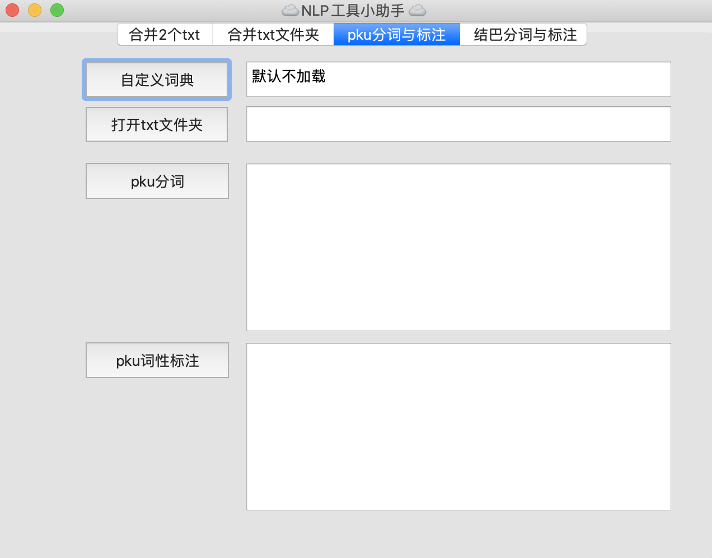

## PyQt5 集成Nlp 小工具，也可作为Pyqt5的入门例子

## 运行环境
- python 3.6.8
- Mac

## 有4个功能
- 合并2个txt
- 合并txt文件夹
- pku分词与标注
- 结巴分词与标注

## 打包成.exe可执行文件
1. 命令：pyinstaller main.py --hidden-import=pkuseg
2. 然后把在终端运行main.exe，把报错的找不到xxx module，需要从安装的python 库中复制进来，放到dist/main里面
P.S. 每次执行前，需要清空一下dist和build文件夹